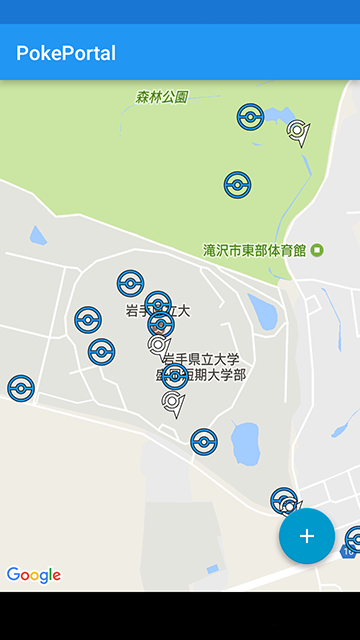
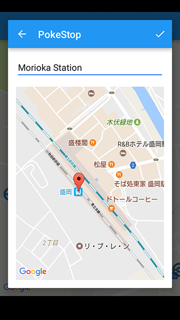
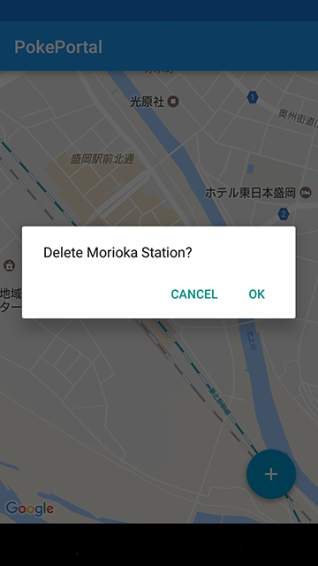

# PokePortal
[](#)
[](#)
[](#)
[](#)
[](#)

## Features
- Create databases of PokeStop and Gym locations
- Display PokeStop and Gym markers on Google map
- Share portal locations using the Android Beam

## ScreenShots
| map | register | delete |
| --- | --- | --- |
|  |  |  |

## Libraries
This project uses some libraries.

- Android Support Libraries
- [android-floating-action-button](https://github.com/futuresimple/android-floating-action-button)
- [Realm](https://realm.io/jp/)

## License
```
Copyright 2016 yuzumone

Licensed under the Apache License, Version 2.0 (the "License");
you may not use this file except in compliance with the License.
You may obtain a copy of the License at

    http://www.apache.org/licenses/LICENSE-2.0

Unless required by applicable law or agreed to in writing, software
distributed under the License is distributed on an "AS IS" BASIS,
WITHOUT WARRANTIES OR CONDITIONS OF ANY KIND, either express or implied.
See the License for the specific language governing permissions and
limitations under the License.
```